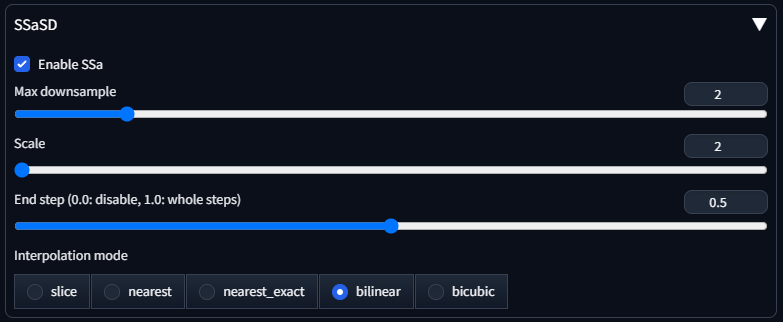
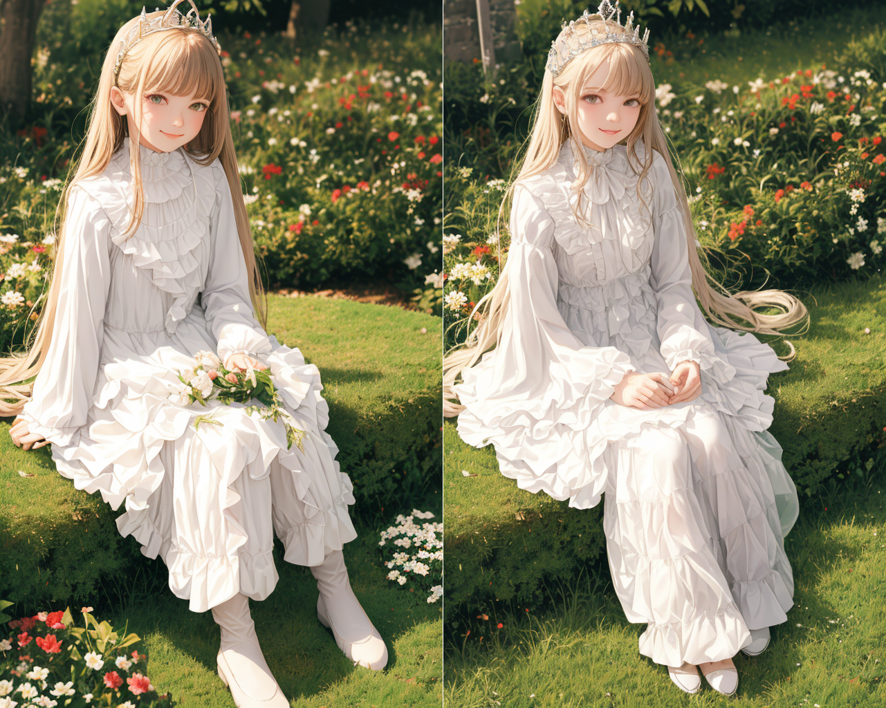
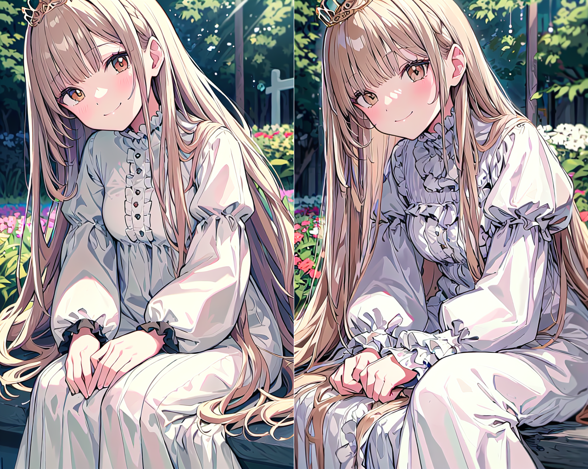

# SSaSD - Shrinked Self-attention for Stable Diffusion

## Installation

### for diffusers

```bash
$ git clone https://github.com/hnmr293/ssasd.git
```

```python
from diffusers import StableDiffusionPipeline
import ssasd

pipe = StableDiffusionPipeline.from_single_file(...)
ssasd.apply_patch(pipe)
```

### for A111 WebUI

```bash
$ cd "your extension directory"
$ git clone https://github.com/hnmr293/ssasd.git
```



## What is this?

This is the script to reduce the size of the latent input to the self-attention layer. Then computation time of the self-attention layer will be reduced and generation speed will be improved.

## Examples

- horizontal - tomesd off/on
- vertical - ssasd(this) off/on


- horizontal - ssasd off/on

```
[setting]
  WebUI
  DPM++ 3M SDE / 30 steps / 640x1024 / cfg scale 3.0
  ssasd: max_downsample=2, scale=2, end_step=0.5(15)
```



- horizontal - ssasd off/on

```
[setting]
  WebUI
  7th_anime_v3_A
  DPM++ 2M Karras / 20 steps / 640x1024 / cfg scale 7.0
  ssasd: max_downsample=1, scale=2, end_step=0.5(10)
```

off: 7.1s
on: 6.1s



## Performance

```
[setting]
  diffusers
  DPM++ 3M SDE / 30 steps / 640x1024 / cfg scale 3.0
  ssasd: max_downsample=2, scale=2, end_step=0.5(15)
```

| setting        | n  | avg (s) | max (s) | min (s) | std. dev. (s) |
| -------------- | -- | ------- | ------- | ------- | ------------- |
| normal         | 10 | 27.10   | 27.64   | 26.54   | 0.41          |
| tomesd         | 10 | 20.01   | 20.41   | 19.36   | 0.37          |
| **ssasd (this)** | **10** | **22.07**   | **22.66**   | **21.49**   | **0.45** |
| **tomesd + ssasd** | **10** | **19.44**   | **20.13**   | **18.93**   | **0.48** |

Yes, [tomesd](https://github.com/dbolya/tomesd) is nice ^^.
